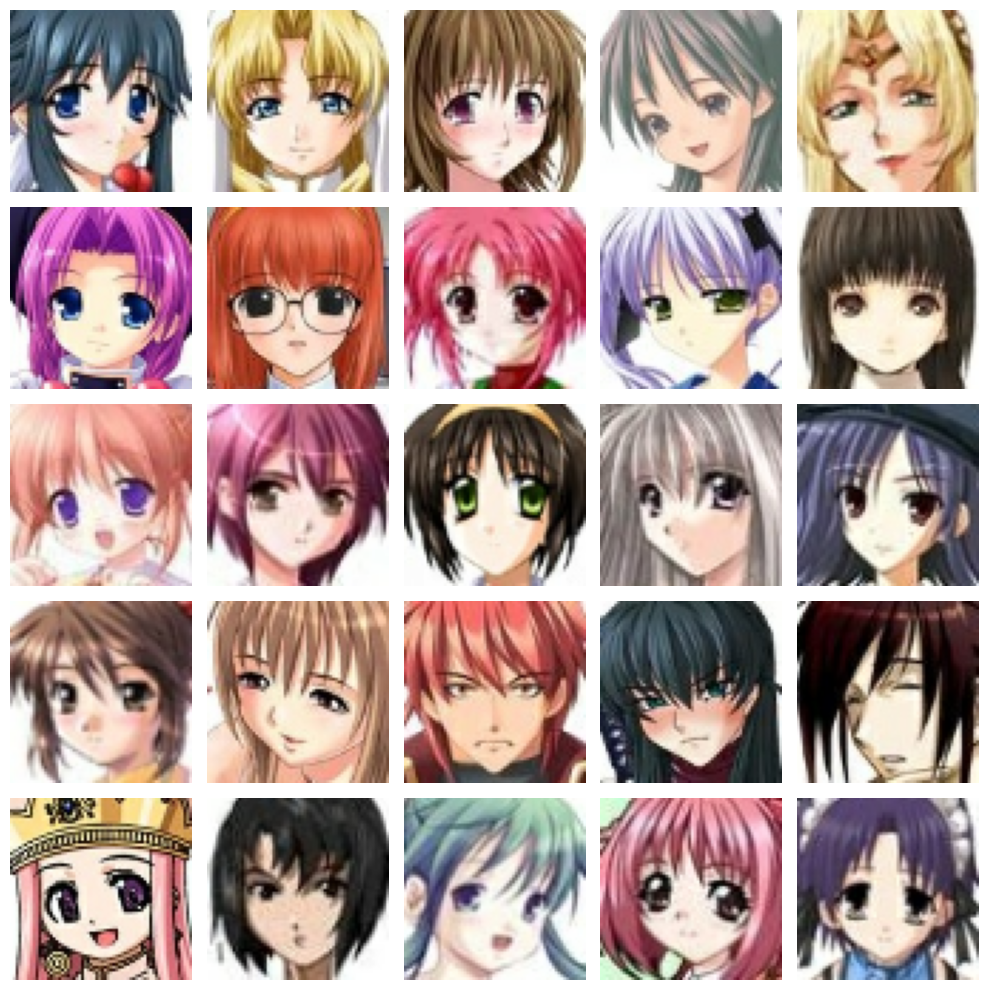
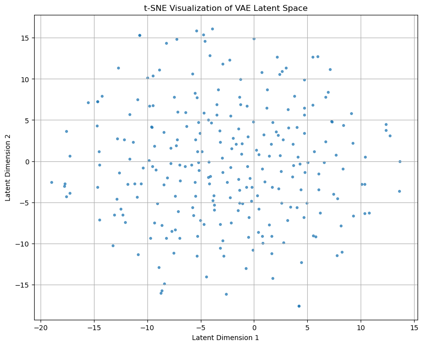

# Anime Character Generation using Unconditional Deep Variational Autoencoder (VAE)

This project implements a **Variational Autoencoder (VAE)** for **unsupervised representation learning** and **image generation and reconstruction** on a dataset of **anime faces**. The objective is to learn a **continuous, structured latent space** that captures the semantic distribution of facial features and enables **new image synthesis** through sampling.

<p align="center">
  
</p>

---

## Introduction

Variational Autoencoders (VAEs) are deep generative models that combine the strengths of probabilistic inference and neural networks. In this project, I have implemented VAE to learn meaningful and continuous representations of anime faces, which can then be used to **generate, interpolate**, and **visualize** unseen face samples.

---

## Data Preprocessing

* **Dataset**: 63,565 cropped anime face images (unlabeled).
* **Dimensions**: All images resized to `64x64` RGB.
* **Split**: 80% Training, 20% Testing.

---

## Model Architecture

The architecture includes three main components:

### Encoder

* Takes an input image of shape `(64, 64, 3)` and passes it through 5 convolutional layers with increasing filters (32 → 512), followed by batch normalization and LeakyReLU activation.
* After flattening, a dense layer compresses the features into a 1024-dimensional vector.
* Finally, two dense layers output the **mean (μ)** and **log variance (log(σ²))** representing the parameters of a Gaussian distribution in latent space.

### Latent Sampling

* Uses the **reparameterization trick**: a latent vector `z` is sampled as `z = μ + σ * ε`, where ε is standard normal noise.
* This allows the model to remain fully differentiable during training.

### Decoder

* The decoder receives the latent vector `z` and reconstructs the image.
* It consists of a dense layer followed by reshaping and a series of Conv2DTranspose layers (512 → 3), ending with a sigmoid activation to produce the final `(64, 64, 3)` image.

<p align="center">
  
</p>

---

## Loss Functions

### 1. **Reconstruction Loss** (`MSE`)
This measures how close the output image is to the original input. It penalizes differences in pixel values between the two. In our case, we use Mean Squared Error (MSE) to compute this.
```math
\mathcal{L}_{\text{recon}} = \mathbb{E}[\| x - \hat{x} \|^2]
```

### 2. **KL Divergence**
This encourages the distribution learned by the encoder to be close to a standard normal distribution (mean 0, variance 1). This regularization keeps the latent space well-structured and continuous, which is crucial for meaningful sampling and interpolation.
```math
\mathcal{L}_{\text{KL}} = -\frac{1}{2} \sum (1 + \log(\sigma^2) - \mu^2 - \sigma^2)
```

### 3. **Total VAE Loss**
The final loss is a weighted sum of the reconstruction loss and the KL divergence. This balance ensures that the model not only learns to reconstruct well but also generates useful, disentangled latent representations.
```math
\mathcal{L}_{\text{VAE}} = \mathcal{L}_{\text{recon}} + \beta \cdot \mathcal{L}_{\text{KL}}
```
This combination allows the VAE to function both as an autoencoder (for reconstruction) and a generative model (for new sample generation).

In our implementation, $\beta = \frac{1}{64 \times 64}$ to balance the KL loss.

---

## Experiments

* Trained on \~63k images over 80 epochs.
* **Latent Space Visualization**: t-SNE on latent vectors
* **Reconstruction Examples**: Input vs Decoded output
* **Unconditional Sampling**: New face generation from random latent vectors

---

## Results

| Original               | Reconstructed          |
| ---------------------- | ---------------------- |
|  |  |

### Latent Space (t-SNE)

<p align="center">
  
</p>

### Loss Curves

### Image Generation Evolution Across Epochs

This section showcases how the model improves over time in generating anime face images. Starting from noisy, blurry outputs in early epochs to sharp, coherent faces as the training progresses.

|                        Epoch 0 |                         Epoch 10 |                         Epoch 20 |                         Epoch 40 |                         Epoch 60 |                         Epoch 80 |
| -----------------------------: | -------------------------------: | -------------------------------: | -------------------------------: | -------------------------------: | -------------------------------: |
|  |  |  |  |  |  |

|                        Epoch 0 |                         Epoch 10 |                         Epoch 20 |                         Epoch 40 |                         Epoch 60 |                         Epoch 80 |                         Epoch 100 |
| -----------------------------: | -------------------------------: | -------------------------------: | -------------------------------: | -------------------------------: | -------------------------------: | --------------------------------: |
|  |  |  |  |  |  |  |


> *The above images are generated from the same latent vector over different training stages.*

---

* The same latent code was used across all epochs to show the improvement in reconstruction fidelity.
* Early epoch images appear noisy or smudged due to incomplete learning.
* Later epochs produce cleaner, more detailed anime faces, indicating better convergence.

---
